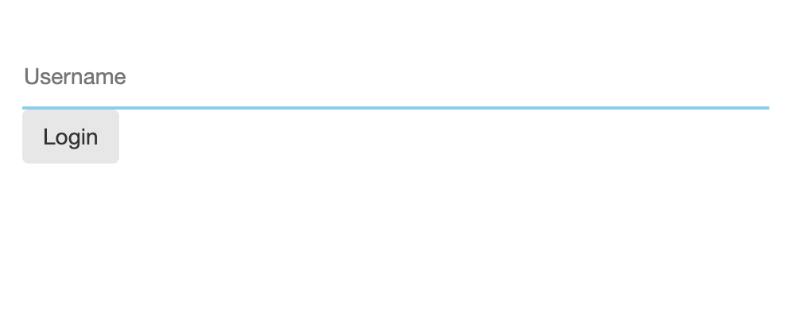
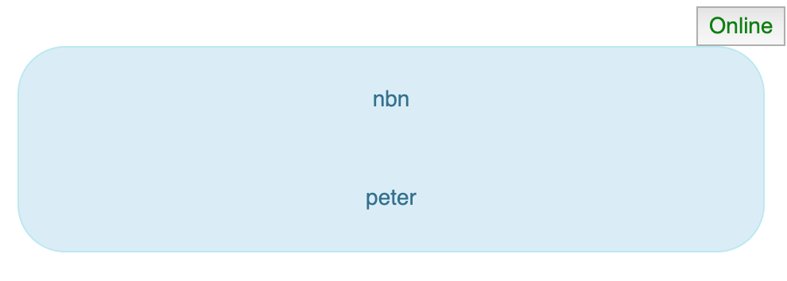
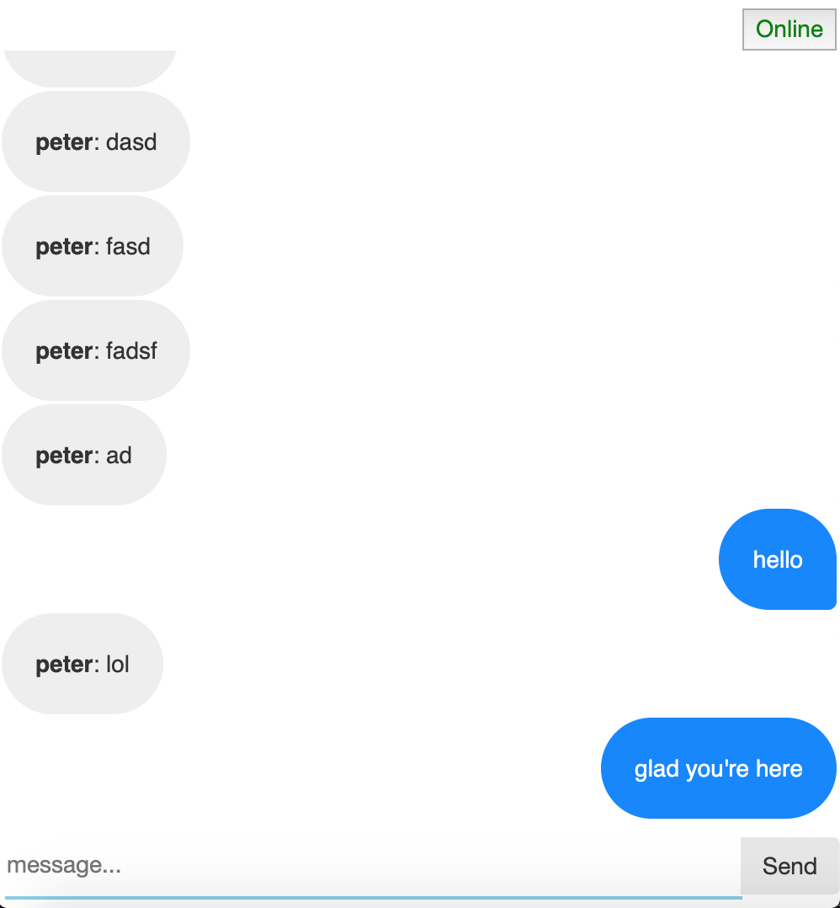
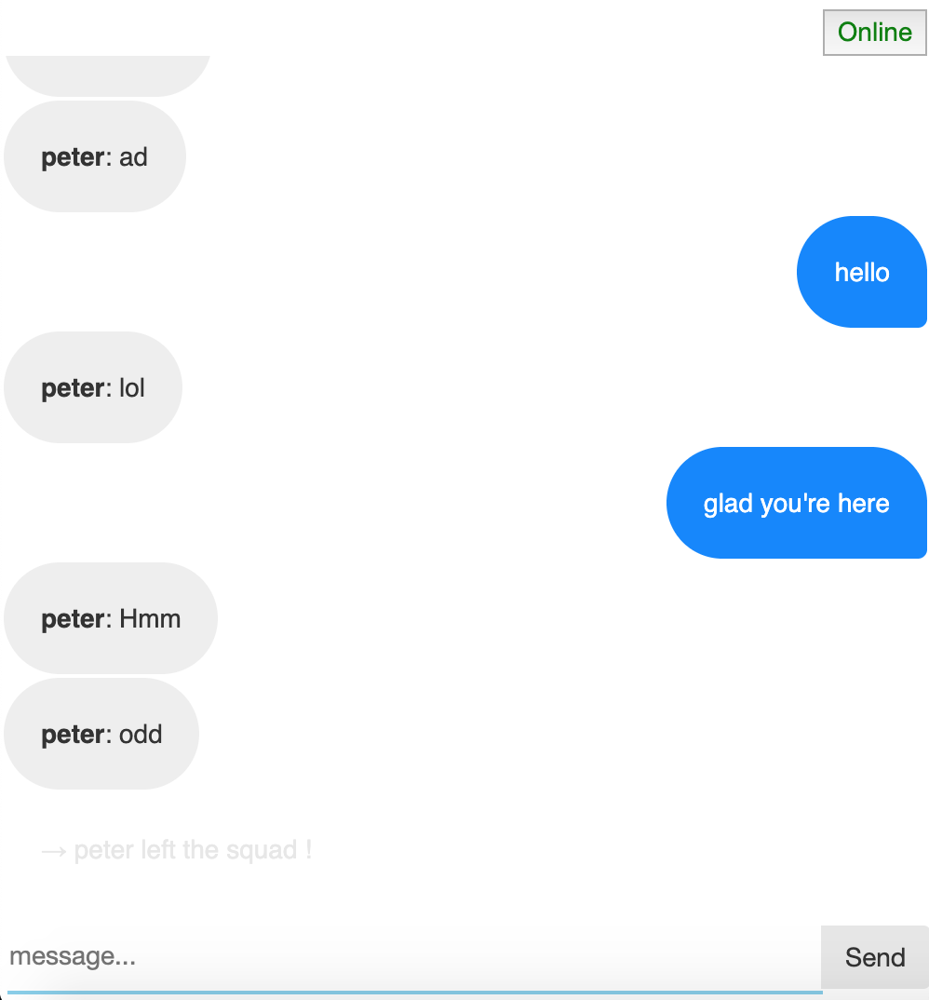

# Simple chat application using Node.js and socket.io
 

  Login formOnline users  Someone joined while taking screenshots

# Supported commands:
  /leave : to leave chatroom and refresh page  
    more coming...
    
# ToDo: 
  save session id and proper authorization  
  kick/ban feature  
  better UI  
  notification feature
  
  # Thanks
  please make a contribution if you can. The purpose of this app is to help beginners.
  
  
